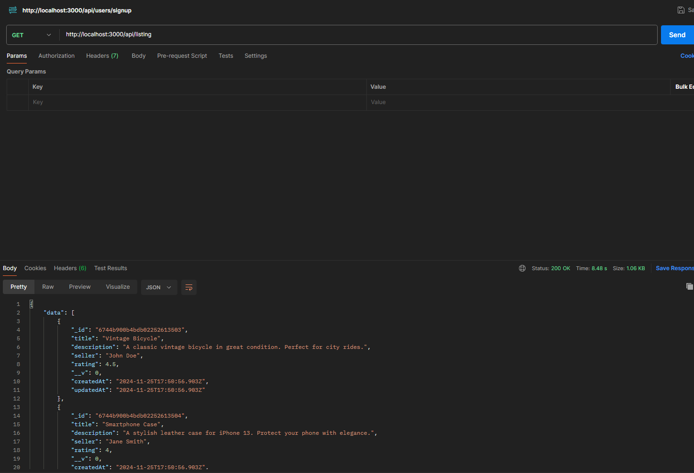
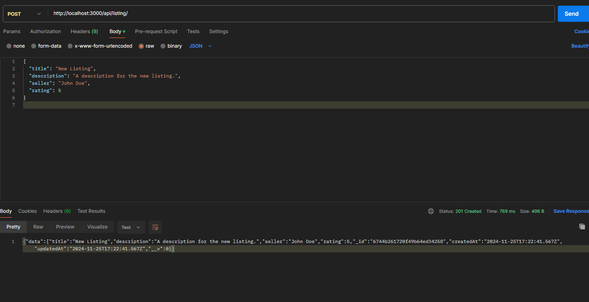
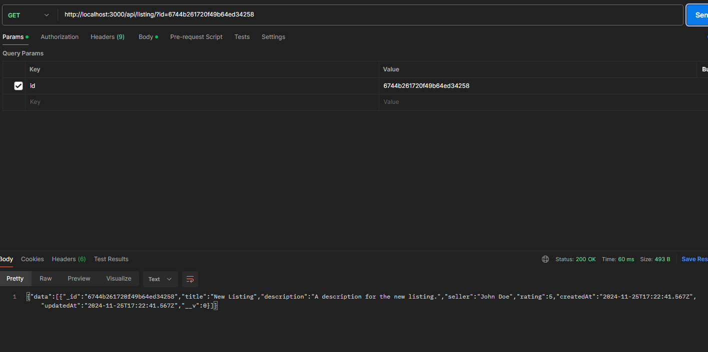
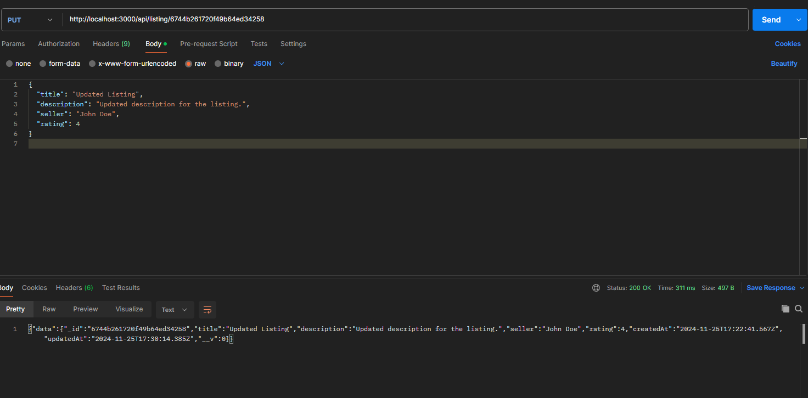
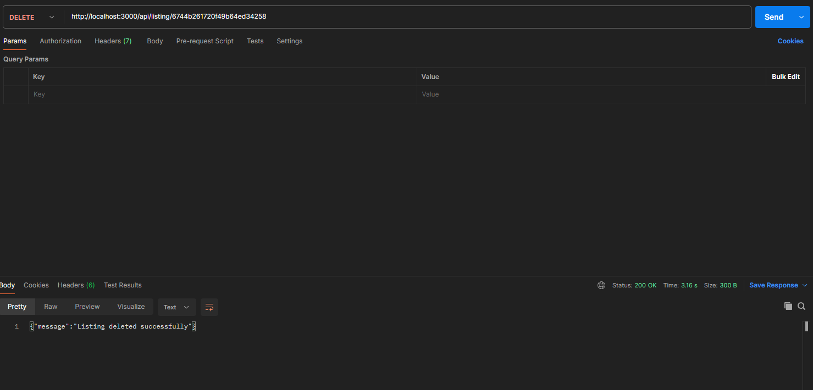

# Shopping API Project 

## Routes Overview

### 1. **GET** `/api/listing`
- **Method**: GET
- **Description**: Retrieves all listings from the database.
- **Example**:  **IMG**  
  

---

### 2. **POST** `/api/listing`
- **Method**: POST
- **Description**: Adds a new item to the listings.
- **Request Body**: 
  ```json
  {
    "title": "string",
    "description": "string",
    "seller": "string",
    "rating": "number" (optional)
  }
  ```
- **Example**:  **IMG**  
  

---

### 3. **GET** `/api/listing/[id]`
- **Method**: GET
- **Description**: Retrieves details of a single item by its ID.
- **Request Params**: 
  - `id`: The unique identifier of the listing.
- **Example**:  **IMG**  
  

---

### 4. **PUT** `/api/listing/[id]`
- **Method**: PUT
- **Description**: Updates the details of an item based on its ID.
- **Request Params**: 
  - `id`: The unique identifier of the listing.
- **Request Body**:
  - JSON object containing the fields to update.
  ```json
  {
    "title": "updated title",
    "description": "updated description",
    "seller": "updated seller",
    "rating": "updated rating"
  }
  ```
- **Example**: **IMG**  
  

---

### 5. **DELETE** `/api/listing/[id]`
- **Method**: DELETE
- **Description**: Deletes a specific listing by its unique ID.
- **Request Params**: 
  - `id`: The unique identifier of the listing.
- **Example**: **IMG**  
  